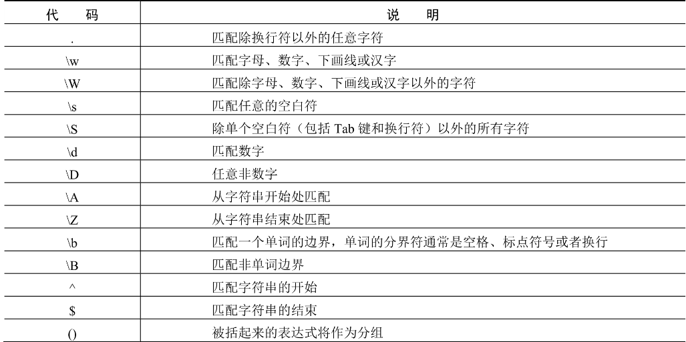
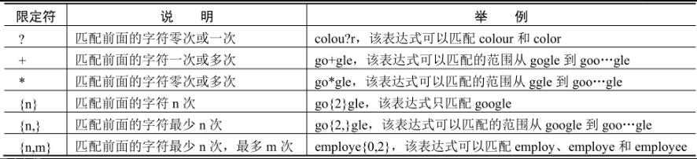

1、行定位符

^ 行的开始，$ 行的结尾

```json
^tm
tm$
```
2、元字符



3、限定符



4、字符类

要想匹配给定字符串中任意一个汉字，可以使用[\u4e00-\u9fa5]

如果要匹配连续多个汉字，则可以使用[\u4e00-\u9fa5]+

5、排除字符

^放到方括号中，表示排除的意思

```commandline
    [^a-zA-Z]
```

6、选择字符

身份证号码的长度为18位，前17位为数字，最后一位是校验位，可能为数字或字符X

匹配身份证

```
     (^\d{18}$)|(^\d{17}(\d|X|x)$)
```

7、转义字符 \

